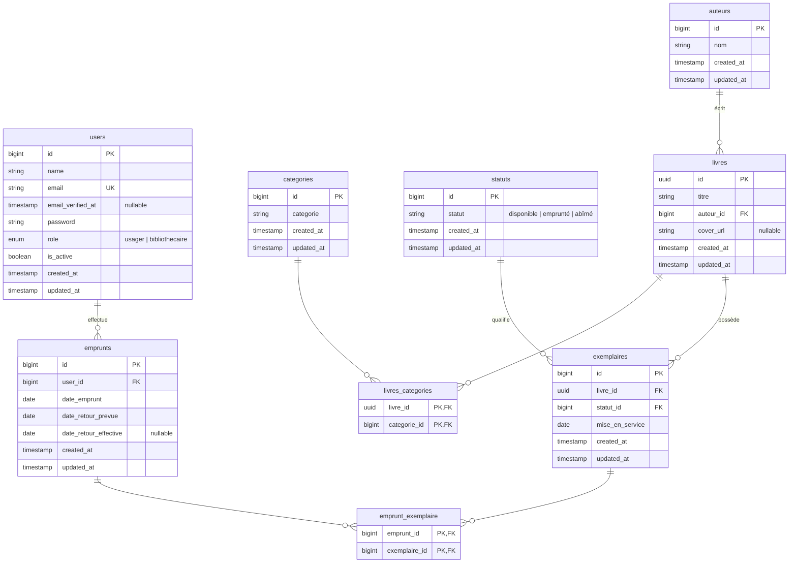

# Modèle entité-association — Mermaid

Ce diagramme se rend automatiquement sur GitHub, GitLab et la plupart des éditeurs Markdown.
Aperçu en ligne : <https://mermaid.live>

```mermaid
erDiagram
    users {
        bigint id PK
        string name
        string email UK
        timestamp email_verified_at "nullable"
        string password
        enum role "usager | bibliothecaire"
        boolean is_active
        timestamp created_at
        timestamp updated_at
    }

    auteurs {
        bigint id PK
        string nom
        timestamp created_at
        timestamp updated_at
    }

    categories {
        bigint id PK
        string categorie
        timestamp created_at
        timestamp updated_at
    }

    statuts {
        bigint id PK
        string statut "disponible | emprunté | abîmé"
        timestamp created_at
        timestamp updated_at
    }

    livres {
        uuid id PK
        string titre
        bigint auteur_id FK
        string cover_url "nullable"
        timestamp created_at
        timestamp updated_at
    }

    livres_categories {
        uuid livre_id PK,FK
        bigint categorie_id PK,FK
    }

    exemplaires {
        bigint id PK
        uuid livre_id FK
        bigint statut_id FK
        date mise_en_service
        timestamp created_at
        timestamp updated_at
    }

    emprunts {
        bigint id PK
        bigint user_id FK
        date date_emprunt
        date date_retour_prevue
        date date_retour_effective "nullable"
        timestamp created_at
        timestamp updated_at
    }

    emprunt_exemplaire {
        bigint emprunt_id PK,FK
        bigint exemplaire_id PK,FK
    }

    auteurs    ||--o{ livres             : "écrit"
    livres     ||--o{ livres_categories  : ""
    categories ||--o{ livres_categories  : ""
    livres     ||--o{ exemplaires        : "possède"
    statuts    ||--o{ exemplaires        : "qualifie"
    users      ||--o{ emprunts           : "effectue"
    emprunts   ||--o{ emprunt_exemplaire : ""
    exemplaires||--o{ emprunt_exemplaire : ""
```
